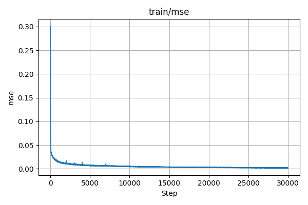
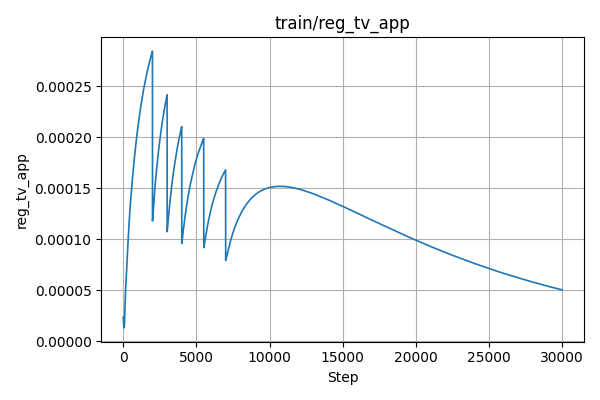
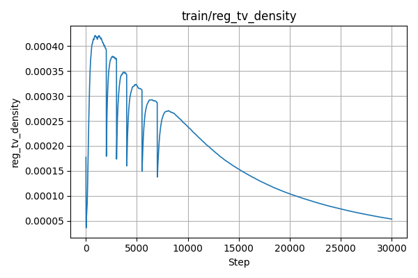

# 期末实验报告：基于 NeRF 的物体重建与新视图合成（TensoRF）

## 一、实验任务简介

本实验任务旨在使用基于 NeRF 的方法，对自采图像进行三维重建并生成新视角图像。  
为提升训练速度和表现效果，本实验采用 TensoRF 加速方法进行训练和渲染。

---

## 二、数据准备与相机参数估计

- 拍摄图像总数：71 张  
- 分辨率：4096 × 3072  
- 相机参数估计工具：COLMAP（命令行版）  
- 使用相机模型：SIMPLE_RADIAL

### COLMAP 处理流程：

1. 图像特征提取（`feature_extractor`）  
2. 特征匹配（`exhaustive_matcher`）  
3. 稀疏重建（`mapper`）  
4. 模型转换（`model_converter` → `.txt`）  
5. 坐标转换为 NeRF 格式（`colmap2nerf.py` → `transforms_train.json`）


## 三、模型与训练配置

- 所用模型：`TensoRF` → `TensorVMSplit`
- 数据加载器：`own_data`
- 配置文件路径：`configs/your_own_data.txt`

### 关键训练参数：

| 参数名称      | 值              |
| ------------- | --------------- |
| batch_size    | 2048            |
| n_iters       | 30000           |
| N_voxel_final | 300 × 300 × 300 |
| lr_init       | 0.02            |
| Optimizer       | Adam            |
### 环境配置：

- 显卡型号：A100
- CUDA 版本：12.1
- PyTorch 版本：2.5.1

### 可视化结果：

> _插入 loss 曲线 / PSNR 曲线（TensorBoard 截图）_

---

## 四、结果展示与评估分析

### 渲染图像示例（测试视角）


### 定量指标对比

| 模型              | PSNR ↑ | SSIM ↑ | LPIPS (Alex) ↓ | LPIPS (VGG) ↓ |
| ----------------- | ------ | ------ | -------------- | ------------- |
| 原版 NeRF（可选） | --     | --     | --             | --            |
| **TensoRF**       | xx.xx  | 0.xxx  | 0.xxx          | 0.xxx         |

> _评价指标由 `compute_metrics.py` 得出_

---

## 五、方法总结与分析

- TensoRF 相比原始 NeRF，训练效率大幅提升（约 x4~x10）
- 渲染质量接近或略优，尤其在少量图像场景下更稳定
- 实验中遇到的问题：
  - transforms 文件格式不匹配
  - COLMAP 模型未输出导致训练失败
  - 图像后缀名不一致导致读取失败
- 优化建议：
  - 添加测试图像独立采集
  - 提前统一图像命名与格式
  - 后续可接入 3D Gaussian 方案作对比

---

## 六、附录

- 模型权重 / 渲染结果（百度云）：[链接](https://pan.baidu.com)
- 配置文件节选：

```ini
# your_own_data.txt
dataset_name = own_data
datadir = ../own_data
n_iters = 30000
batch_size = 2048
model_name = TensorVMSplit
N_voxel_final = 27000000
lr_init = 0.02
...
```

## 训练指标曲线分析（TensoRF）

为评估模型训练过程中的学习效果，我们记录并可视化了如下四类关键指标曲线，分别为 PSNR、MSE、reg_tv_app、reg_tv_density。

### 1. PSNR 曲线（Peak Signal-to-Noise Ratio）

- 衡量模型渲染图像与真实图像的相似度，值越高代表质量越好。
- PSNR 从初始的 5 快速提升至 27，整体趋势持续上升，表明模型训练收敛良好，渲染质量稳定提升。


---

### 2. MSE 曲线（Mean Squared Error）

- 衡量像素预测误差的均方值，越低越好。
- 曲线呈现出指数衰减趋势，从约 0.3 降至 0.0005 以下，说明网络损失快速下降且稳定。



---

### 3. Appearance TV 正则项（train/reg_tv_app）

- 控制外观编码（appearance embedding）的平滑性，防止图像出现纹理噪声。
- 曲线前期震荡，后期平稳，说明正则项有效抑制噪点、辅助网络收敛。



---

### 4. Density TV 正则项（train/reg_tv_density）

- 控制体素密度在空间中的连续性，避免结构跳变。
- 曲线趋势与 reg_tv_app 类似，最终平稳，表明几何场结构逐步合理。



---

### 📋 指标与趋势表格

| 指标名             | 物理意义                  | 趋势分析                  | 训练作用             |
| ------------------ | ------------------------- | ------------------------- | -------------------- |
| **train/psnr**     | 图像峰值信噪比（↑）       | 平稳上升，最终 > 27       | 反映模型重建精度提升 |
| **train/mse**      | 像素均方误差（↓）         | 快速下降至 0.000x         | 损失稳定收敛         |
| **reg_tv_app**     | 外观编码平滑性正则项（↘） | 初震荡 → 后平稳           | 降低纹理过拟合或噪声 |
| **reg_tv_density** | 密度场连续性约束（↘）     | 类似 reg_tv_app，稳定收敛 | 辅助模型几何边界连贯 |

> 所有图像已保存在报告目录下，可插入至 PDF 或 Word 报告正文。
